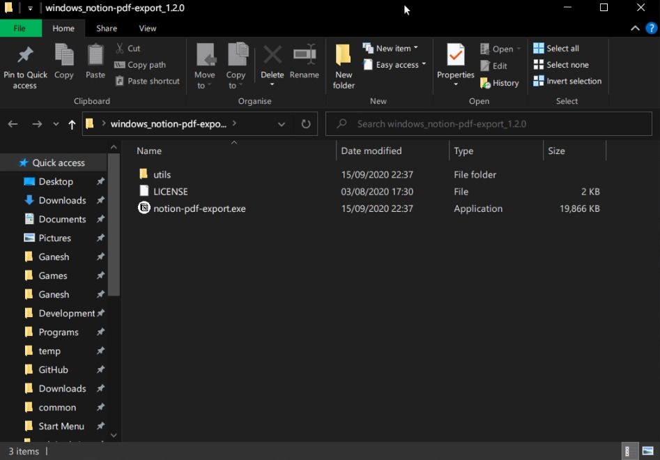
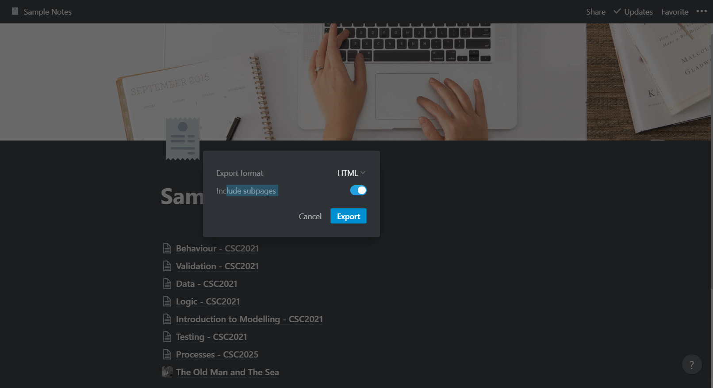
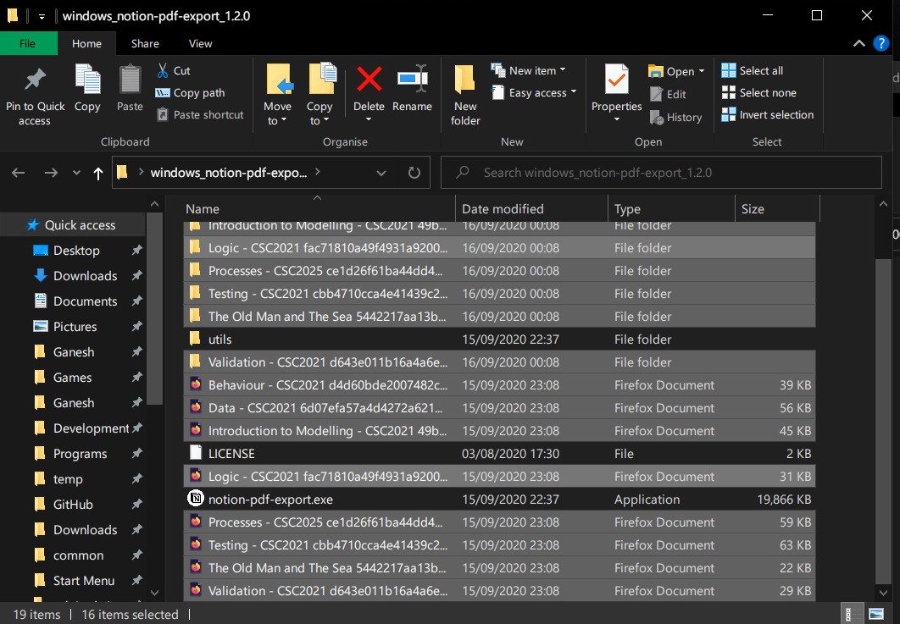
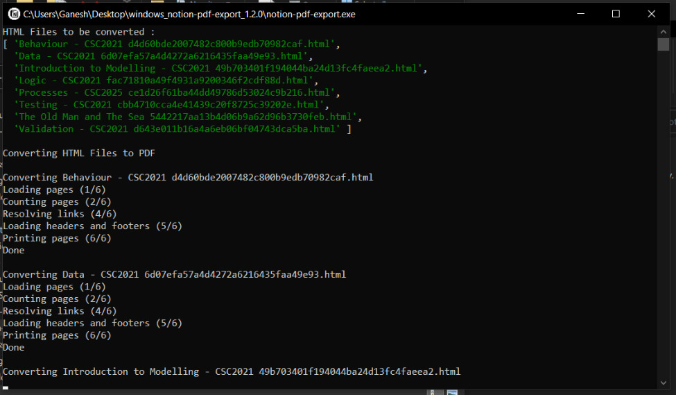
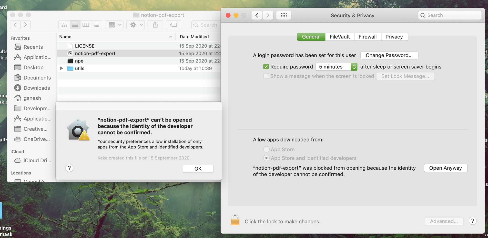
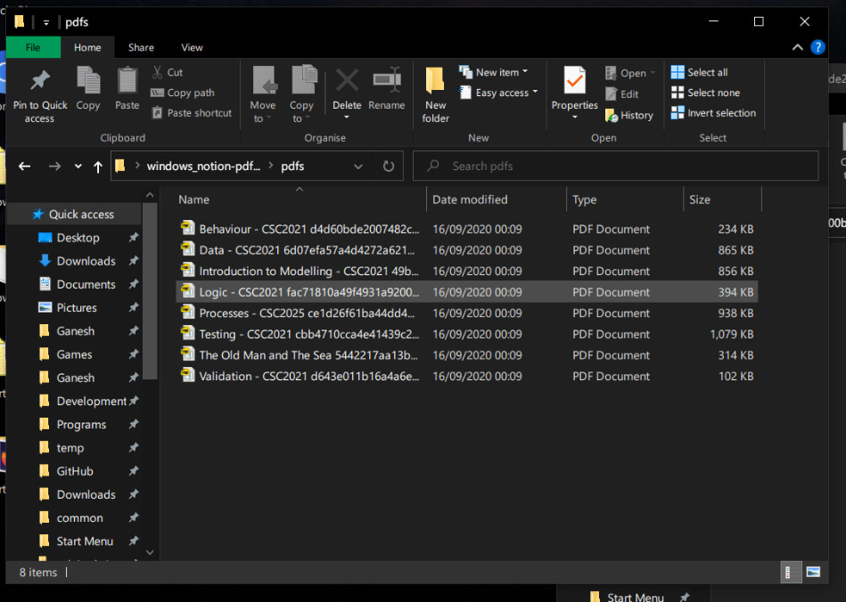

# Notion PDF Export

A tool to allow batch PDF export for free Notion users. You can export as HTML with subpages and then use this tool to convert those into PDFs.

- [Download](#download)
- [Usage](#usage)
- [Building](#building)
  - [Source Code](#source-code)
  - [Running the Project on Node](#running-the-project-on-node)
  - [Compiling an Executable](#compiling-an-executable)
    - [Installing nexe](#installing-nexe)
      - [To Install Automatically:](#to-install-automatically)
      - [To Install Manually:](#to-install-manually)
    - [Compiling Executables](#compiling-executables)
      - [Compile Automatically](#compile-automatically)
      - [Compile Manually](#compile-manually)
- [Credits](#credits)
  - [wkhtmltopdf](#wkhtmltopdf)
  - [Assets](#assets)

## Download

Get the latest download for Windows and macOS from the releases page:

## Usage

1. Download the tool and extract.
    
2. In [Notion](https://notion.so), place all the pages you wish to export into one page and click Export, choose 'HTML' and ensure 'Include Subpages' is on.
    
3. Extract the export to find a list of HTML files and folders for each page. Place the HTML files with folders containing images in the same folder as `notion-pdf-export.exe` (Windows) or `notion-pdf-export` (macOS).  
    
4. Double click `notion-pdf-export.exe` (Windows) or `notion-pdf-export` (macOS) and wait for the process to be completed.  
      
    If nothing happens, you may need to go to macOS security settings and click 'Open Anyway':  
    
5. All the individual pages can be found converted into PDF Documents inside the `pdfs` folder.  
    

---

## Building

### Running the Project on Node

1. Clone/Download the project and run the command in the project root directory:
    ```bash
    npm install
    ```
2. Run this command to run the script:
    ```bash
    node index.js
    ```
### Compiling an Executable

This is tricky. A lot of adjustments had to be made so that it can run without node.

#### Installing nexe

Executables are compiled with a very [specific version of nexe](https://github.com/cspotcode/nexe/tree/fix-vfs) that allows access to the filesystem, which has a tricky setup procedure.

##### To Install Automatically:

- **Windows** - Run `install_nexe_win.bat` as admin, will take about 5 minutes to install fully.
- **macOS** - Run the `install_nexe_mac` shell script, will take about 5 minutes to install, and you will need to enter an admin password. This sometimes doesn't seem to work properly, so might be worth doing manual install if there's problems.

##### To Install Manually:

1. Firstly, install the general [nexe](https://www.npmjs.com/package/nexe) package  globally:
    - **Windows** (in command prompt must be running as admin):
        ```bash
        npm install -g nexe
        ```
    - **macOS** (in the terminal):
        ```bash
        sudo npm install -g nexe
        ```

2. In the project root folder build some executables with this version of nexe to download node binaries for Windows and macOS:
    ```bash
    nexe . --target win32-x86-10.13.0
    nexe . -t macos-10.13.0
    ```
    This will download the binaries we need for later, delete the executables built with this for now.
3. Now we need to install a [specific version of nexe](https://github.com/cspotcode/nexe/tree/fix-vfs) that allows access to the filesystem:
   - **Windows** (in command prompt must be running as admin):
        ```bash
        npm install -g cspotcode/nexe#19a5046
        ```
    - **macOS** (in the terminal):
        ```bash
        sudo npm install -g cspotcode/nexe#19a5046
        ```
    Now we should have the correct version of nexe for building. Confirm by running:

    ```bash
    nexe -v
    ```
    Check that the version is `4.0.0-beta.4`

#### Compiling Executables

##### Compile Automatically
- **Windows** (on a Windows system):
    Run the batch script `build_win32.bat` to build a Windows executable. This can be found in `/dist/win32` and everything in that folder must be distributed together.
 - **macOS** (on a macOS system):
    Run the shell script `build_macos` to build a macOS executable. This can be found in `/dist/macos` and everything in that folder must be distributed together.

If you wish to compile for macOS on Windows or vice versa, you can do so using the manual method below.


##### Compile Manually
- To build a **Windows** executable, in the root directory of the project, run the command:
    ```bash
    nexe . --target win32-x86-10.13.0 -o ./dist/win32/notion-pdf-export.exe
    ```
    When distributing the executable `notion-pdf-export.exe` must be placed in a directory with the original `utils` folder from the source.

- To build a **macOS** executable, in the root directory of the project, run the command:
    ```bash
    nexe . -t macos-10.13.0 -o ./dist/macos/npe
    ```
    Note that this is built under the name `npe` due to an issue with accessing the current directory.
    When distributing, place the `npe` executable it in a directory with the following:
    - The original `utils` folder from the source code
    - An executable unix shell script with the following contents, with the file name of `notion-pdf-export`:
    ```bash
    #/bin/bash
    cd "$0"/..
    ./npe
    ```
    This can be obtained from `mac_script.sh` or found inside `/dist/macos` This script is needed to set the current directory before the `npe` executable is run.

## Credits
